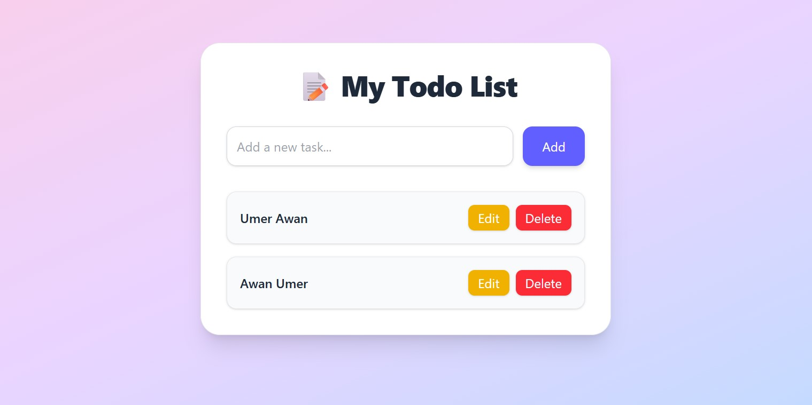

# 📝 Redux Toolkit TODO App (React + Vite + TailwindCSS)

A simple, responsive, and modern **TODO application** built with **React**, **Vite**, **Redux Toolkit**, and **TailwindCSS**.  
It supports **adding**, **updating**, and **removing** todos with a clean user interface and instant state updates.

---

## 🚀 Features

- ➕ **Add Todos** – Create new tasks instantly
- ✏ **Update Todos** – Edit existing tasks with one click
- ❌ **Delete Todos** – Remove completed or unnecessary tasks
- ⌨ **Press Enter to Add** – Quickly add todos using the keyboard
- 🌈 **Beautiful UI** – Gradient background & modern styling with TailwindCSS
- ⚡ **Fast Performance** – Powered by Vite’s Hot Module Replacement (HMR)
- 🗂 **State Management** – Managed globally with Redux Toolkit

---

## 📂 Folder Structure

project/


│ index.html

│ package.json

│ vite.config.js

│ README.md

│

├─ src/

│ ├─ images/ # Screenshots and images

│ │ └─ screenshot.png

│ ├─ Store/

│ │ ├─ Slice/

│ │ │ └─ Slice.js # Redux Toolkit slice for todos

│ │ └─ store.js # Redux store configuration

│ │
│ ├─ App.jsx # Main app with add, edit, delete logic

│ └─ main.jsx # Entry point with Provider

│

└─ public/ # Public assets

yaml
Copy
Edit

---

## 🛠 Installation & Setup

1. Clone the repository
```bash
git clone https://github.com/your-username/redux-toolkit-todo.git
Navigate to the project folder

bash
Copy
Edit
cd redux-toolkit-todo
Install dependencies

bash
Copy
Edit
npm install
🖥 Run Locally
Start the development server:

bash
Copy
Edit
npm run dev
Open your browser at:

arduino
Copy
Edit
http://localhost:5173
📦 Build for Production
bash
Copy
Edit
npm run build
Preview production build:

bash
Copy
Edit
npm run preview
🧠 Technologies Used
React – UI Library

Vite – Build tool for fast development

Redux Toolkit – Global state management

TailwindCSS – Utility-first styling

ESLint – Code linting

Screenshot



